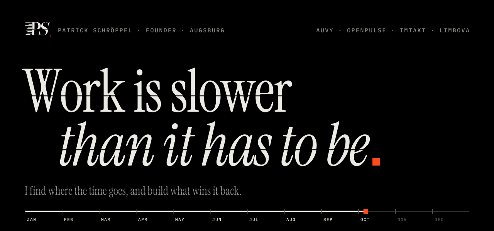
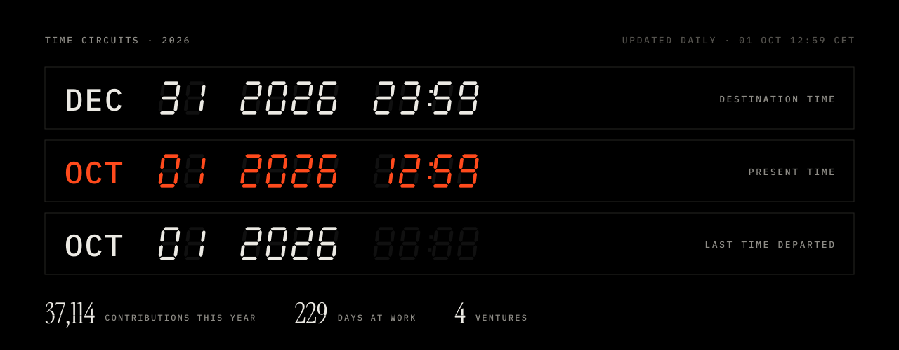
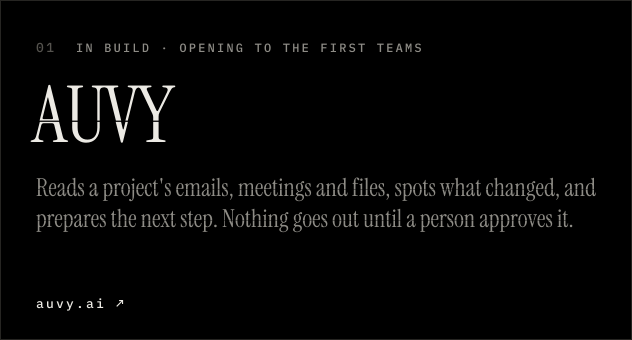
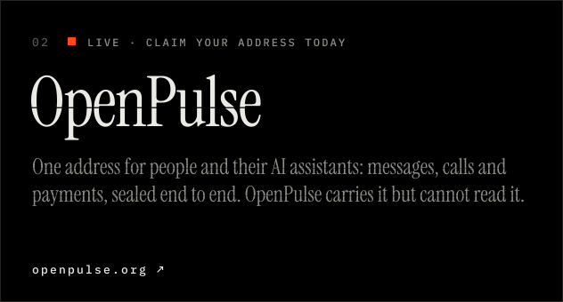
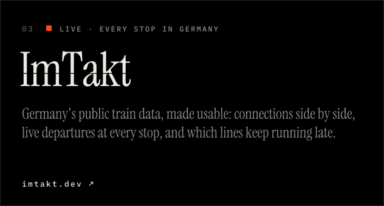
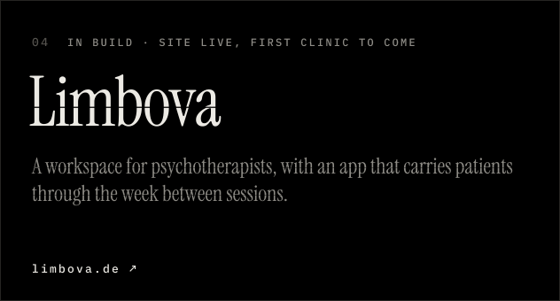

<!-- Every image here is drawn by scripts/build.py; the time circuits refresh daily. -->

<a href="https://patrickschroeppel.com"><picture><source media="(prefers-color-scheme: dark)" srcset="assets/hero-dark.svg"><source media="(prefers-color-scheme: light)" srcset="assets/hero-light.svg"></picture></a>

<picture><source media="(prefers-color-scheme: dark)" srcset="assets/circuits-dark.svg"><source media="(prefers-color-scheme: light)" srcset="assets/circuits-light.svg"></picture>

<picture><source media="(prefers-color-scheme: dark)" srcset="assets/h-ventures-dark.svg"><source media="(prefers-color-scheme: light)" srcset="assets/h-ventures-light.svg"></picture>

<a href="https://auvy.ai"><picture><source media="(prefers-color-scheme: dark)" srcset="assets/v-auvy-dark.svg"><source media="(prefers-color-scheme: light)" srcset="assets/v-auvy-light.svg"></picture></a>
<a href="https://openpulse.org"><picture><source media="(prefers-color-scheme: dark)" srcset="assets/v-openpulse-dark.svg"><source media="(prefers-color-scheme: light)" srcset="assets/v-openpulse-light.svg"></picture></a>

<a href="https://imtakt.dev"><picture><source media="(prefers-color-scheme: dark)" srcset="assets/v-imtakt-dark.svg"><source media="(prefers-color-scheme: light)" srcset="assets/v-imtakt-light.svg"></picture></a>
<a href="https://limbova.de"><picture><source media="(prefers-color-scheme: dark)" srcset="assets/v-limbova-dark.svg"><source media="(prefers-color-scheme: light)" srcset="assets/v-limbova-light.svg"></picture></a>

<picture><source media="(prefers-color-scheme: dark)" srcset="assets/h-research-dark.svg"><source media="(prefers-color-scheme: light)" srcset="assets/h-research-light.svg"></picture>

**Memory.** How does a team remember what changed? 
[How AUVY remembers and finds](https://auvy.ai/research) · *coming:* MemContinuity, a benchmark for whether a company's memory stays true over time · *coming:* From noticing to acting

**Waiting.** Where does the waiting actually happen? 
[Verspätungen im Fernverkehr 2026](https://imtakt.dev/bericht/verspaetungen-2026) · *coming:* How Deutsche Bahn could run on time, a full study

**Trust.** How can people and their AI assistants share work without sharing secrets? 
[How privacy works at OpenPulse](https://openpulse.org/security)

**Care.** What happens to therapy between the sessions? 
[The study behind Limbova](https://limbova.de)

Everything, with notes and open questions: [patrickschroeppel.com/blog](https://patrickschroeppel.com/blog)

 

<a href="https://patrickschroeppel.com"><picture><source media="(prefers-color-scheme: dark)" srcset="assets/b-site-dark.svg"><source media="(prefers-color-scheme: light)" srcset="assets/b-site-light.svg"></picture></a>
<a href="https://www.linkedin.com/in/patrick-schroeppel"><picture><source media="(prefers-color-scheme: dark)" srcset="assets/b-linkedin-dark.svg"><source media="(prefers-color-scheme: light)" srcset="assets/b-linkedin-light.svg"></picture></a>
<a href="mailto:patrick.schroeppel@auvy.ai"><picture><source media="(prefers-color-scheme: dark)" srcset="assets/b-mail-dark.svg"><source media="(prefers-color-scheme: light)" srcset="assets/b-mail-light.svg"></picture></a>

Also building <a href="https://patrickschroeppel.com/imstudium">ImStudium</a>, the study system for my own degree. Type: PS Kairos and IBM Plex Mono, both SIL OFL.
